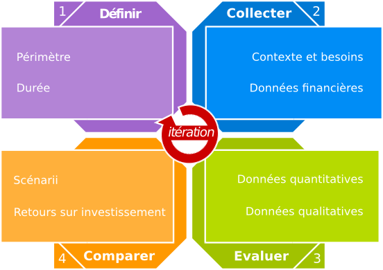

# Processus Général

La démarche d’évaluation de la méthode ECOS, composée de quatre étapes interdépendantes, commence en amont avant d’effectuer un choix, se poursuit pendant la mise en place ou la migration d’une partie du système d’information et continue après la transition terminée, en service régulier.

##  Application continue

La méthode ECOS peut être utilisée avant, pendant et après la mise en place d’une solution libre et open Source au sein du système d’information.

###  Avant
La méthode ECOS peut être utilisée avant de prendre une décision. Elle permet de révéler les éléments importants permettant un choix avisé concernant l’adoption, la migration ou le rejet d’une solution libre et Open Source. La méthode permet d’identifier plusieurs cibles et plusieurs chemins de migration pertinents ainsi que de découvrir des opportunités intéressantes.

###  Pendant
La méthode ECOS peut être utilisée pendant la mise en place d’une solution libre et Open Source. Elle permet de fournir des rapports financier, de suivre les écarts, d’affiner ou de réviser des hypothèses de départ et d’identifier des bifurcations économiques intéressantes.

###  Après
La méthode ECOS peut être utilisée après la mise en place d’une solution libre et Open Source. Elle permet de valider des hypothèses, d’effectuer un bilan du projet et de communiquer les résultats.

##  Étapes interdépendantes

La démarche générale d’ECOS se décompose en plusieurs étapes interdépendantes pouvant être appliquées avec des granularités différentes afin de s’adapter au niveau de détail souhaité :

+------------------+---------------------------------------------------------------------------------+
| Étape            | Description                                                                     |
+==================+=================================================================================+
| Définir          | Définition avec la participation des équipes en charge du système d’information |
|                  | des domaines et secteurs qui feront l’objet d’une étude approfondie, ainsi que  |
|                  | de la durée sur laquelle portera l'étude.                                       |
+------------------+---------------------------------------------------------------------------------+
| Collecter        | Recueil de données concernant le système d’information, son urbanisation,       |
|                  | ses usages et ses coûts. Cela nécessite la participation des équipes en charge  |
|                  | du système d’information au travers de plusieurs interview et la fourniture de  |
|                  | données chiffrées.                                                              |
+------------------+---------------------------------------------------------------------------------+
| Évaluer          | Évaluation de l’opportunité de migration et des alternatives libres ou Open     |
|                  | Source pertinentes.                                                             |
+------------------+---------------------------------------------------------------------------------+
| Comparer         | Comparaison quantitative et qualitative de scenarii pertinents avec leur        |
|                  | avantages, inconvénients, coûts, bénéfices et retours sur investissement.       |
+------------------+---------------------------------------------------------------------------------+
